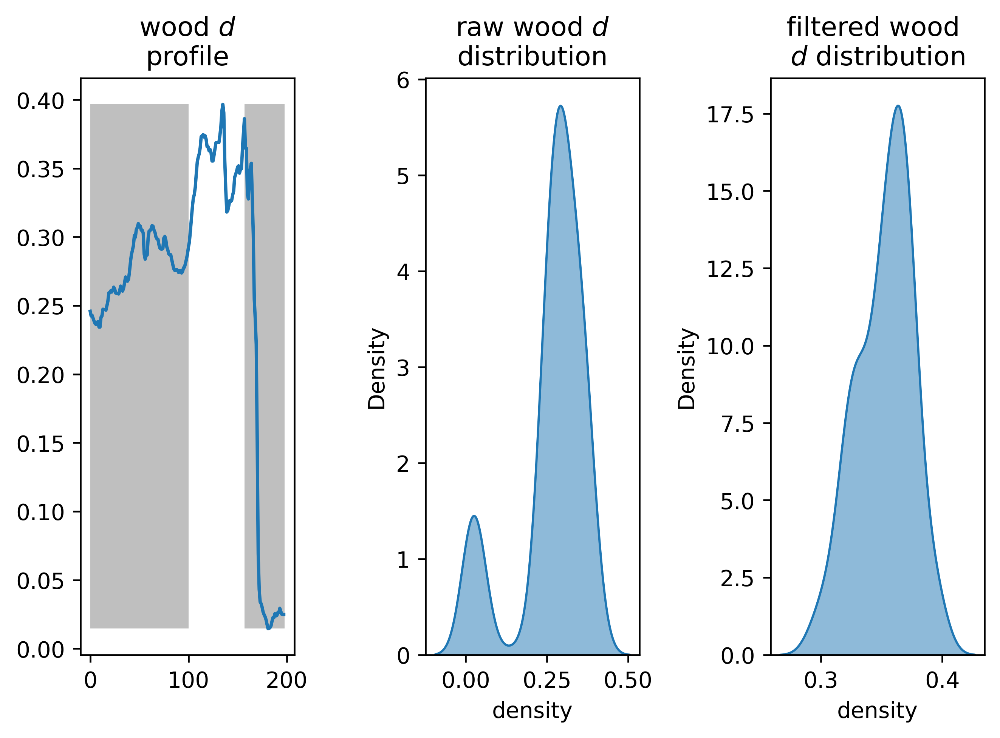

# Wood Density

## The program

This program is intented to filter and to aggregate the .pxb files that contains X-Ray profiles of wood pieces that can be used to compute wood density.

### Steps

Program steps:
- fill the **conf file**
- all .pxb files within the defined folder are detected, then they are read one by one
- the density profile is plotted and we can select the minimum and maximum boundary values by clicking on the graph
- a new column 'keepit' is added with values equal to 1 for the indices included between the two boundaries and 0 otherwise
- the df is concatenated with the previous one

optional:
- we can provide a fata frame with labels, it should contain two columns: 'label','sample'. the agregated data frame will be merged with the label data frame using the key: 'sample'

### Output

Four output files are produced:
- df_header.csv: metadate associated with each sample
- df_data.csv: agregated data files
- density.csv: fully agregated data file
- figures: each figure is saved within the folder figure

## How to install?

### Install Python version if needed

[Anaconda](https://www.anaconda.com/products/individual)

[Miniconda](https://docs.conda.io/en/latest/miniconda.html

### Download full folder from git

1. Direct download

From the green box  named 'clone' in the right corner > download .zip

2. From the terminal

>
> git clone https://github.com/xbouteiller/WoodDensity.git
>

### Install dependencies

>
> pip install -r requirements.txt 
>

### Program Execution

Set the **conf file** with your own parameters, then execute in the terminal:

>
> python main.py
>